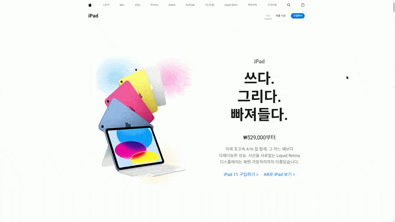

# iPad 11 Rebuild Project

Apple Korea의 iPad 제품 페이지를 참고해, 정적 퍼블리싱만으로 인터랙션과 정보 구조를 다시 설계한 프론트엔드 리빌드 프로젝트입니다.  
단순한 화면 복제가 아니라, Hero 모션, 헤더 패널, 제품 내비게이션, 비교 섹션, 접근성 흐름까지 직접 구현하고 구조를 다듬는 데 목적을 두었습니다.

 

 

## 목차

- [프로젝트 개요](#프로젝트-개요)
- [배포 미리보기](#배포-미리보기)
- [브랜치 운영 기준](#브랜치-운영-기준)
- [`dev`와 `master`의 차이](#dev와-master의-차이)
- [이 프로젝트에서 다룬 문제](#이-프로젝트에서-다룬-문제)
- [핵심 작업](#핵심-작업)
- [기술 스택](#기술-스택)
- [디렉터리 구조](#디렉터리-구조)
- [실행 방법](#실행-방법)
- [문서](#문서)
- [이 프로젝트에서 보여주고 싶은 역량](#이-프로젝트에서-보여주고-싶은-역량)
- [한 줄 요약](#한-줄-요약)

## 프로젝트 개요

- 프로젝트 유형: 포트폴리오형 퍼블리싱 리빌드
- 기준 페이지: Apple Korea iPad 제품 소개 페이지
- 구현 범위: Hero, 디자인 섹션, 제품 소개 섹션, 비교 섹션, 헤더 패널, 푸터, 404 흐름
- 핵심 목표: Apple 스타일의 정보 밀도와 인터랙션 흐름을 Vanilla Frontend로 재구성
- 레거시 기록 브랜치: `main`
- 프로덕션 브랜치: `master`
- 개발 기준 브랜치: `dev`
- 릴리즈 검증 브랜치: `release/1.0.0`

## 배포 미리보기

| 구분 | 브랜치 | 성격 | 배포 플랫폼 | 링크 |
|---|---|---|---|---|
| 최신 / after | `master` | 초기 리빌드 결과물과 레거시 구조를 포함한 이전 기준 | Netlify | [https://itb4ng-ipad.netlify.app/](https://itb4ng-ipad.netlify.app/) |
| 구버전(레거시) / before | `main` | release 검증을 마친 최신 운영 기준 결과물 | Vercel | [https://ipad102.vercel.app/](https://ipad102.vercel.app/) |

결과물만 보여주는 repo.가 아닌
리빌드 프로젝트가 어떤 과정으로 발전했는지까지 드러내도록 구성하였고
기존 main 배포본과 현재 master 배포본을 나란히 비교할 수 있게 두었다.
이를 통해 개선 과정과 브랜치 운영 흐름까지 함께 볼 수 있음.

## 브랜치 운영 기준

기획, 구현, 검수, 릴리즈 분리 과정을 포트폴리오용으로 설명 가능하게 남기는 방식으로 관리했습니다.

### `main`

`main`은 현재 운영 기준 브랜치는 아니지만, 프로젝트의 이전 단계와 레거시 구조를 보여주는 기록 브랜치입니다.

이 브랜치에는 다음 의미를 남겨두고 싶었습니다.

- 초기 리빌드 결과물과 before / after 비교 기준
- 구조를 다시 잡기 전의 구현 방식과 프리뷰 검증 흐름
- 단일 결과물보다 “어떻게 개선되었는가”를 보여주는 포트폴리오 기록

즉, `main`은 버려진 브랜치가 아니라  
**기존 프로젝트와 최신 프로젝트의 차이를 설명하기 위한 기준점**입니다.

### `dev`

`dev`는 프로젝트의 기획, 기능 개발, 구조 개선, 문서화 작업이 누적되는 통합 개발 브랜치입니다.

주요 역할은 다음과 같습니다.

- 헤더 패널, 모바일 메뉴, 제품 내비게이션 등 인터랙션 개선 작업 진행
- CSS 구조 분리와 리팩토링 작업 진행
- 접근성 흐름, 키보드 탐색, focus 처리 개선
- 문서화, QA 체크리스트, 릴리즈 전 검수 기준 정리
- 다음 기능 개선이나 유지보수 작업의 기준점 역할

즉, `dev`는 단순히 코드가 모이는 브랜치가 아니라  
**어떤 문제를 발견했고, 어떤 기준으로 개선했는지의 과정이 남아 있는 브랜치**입니다.

### `release/1.0.0`

`release/1.0.0`은 `dev`에서 릴리즈 가능한 상태라고 판단한 시점에 생성한 검증용 브랜치입니다.

주요 역할은 다음과 같습니다.

- Netlify 배포 환경에서 실제 배포 상태 검증
- 데스크탑, 태블릿, 모바일 화면 최종 확인
- 헤더, 푸터, Hero, 비교 섹션, 404 흐름 점검
- 배포 직전 문서와 리소스 상태 확인
- 릴리즈 중 발견된 작은 수정사항 반영

이 브랜치는 개발을 계속 확장하기 위한 브랜치라기보다,  
**현재 버전을 배포해도 되는지 판단하기 위한 안정화 브랜치**입니다.

### `master`

`master`는 현재 프로덕션 배포 기준 브랜치입니다.

`release/1.0.0`에서 Netlify 배포 검증을 마친 뒤, 해당 시점을 기준으로 `master`를 생성하고 GitHub 기본 브랜치와 Netlify deploy 브랜치를 `master`로 변경했습니다.

따라서 현재 `master`는 다음 의미를 가집니다.

- 실제 배포 기준이 되는 안정 브랜치
- 포트폴리오에서 보여줄 수 있는 최종 릴리즈 상태
- `release/1.0.0` 검증 결과가 반영된 프로덕션 기준점
- 이후 태그 `v1.0.0`을 찍을 수 있는 기준 커밋

추가로 `main`을 그대로 덮어쓰지 않고 `master`를 별도로 둔 이유는 분명합니다.

- 이전 리빌드 결과와 최신 운영 결과를 섞지 않기 위해
- 브랜치 전략 자체를 포트폴리오의 일부로 설명하기 위해
- “개선 전 구조”와 “검증을 거친 최신 구조”를 배포 단계에서 분리해 보여주기 위해
- 단순 결과 비교가 아니라, 프로젝트의 성장 과정과 운영 판단을 함께 남기기 위해

즉, 이 프로젝트에서 브랜치 전략은 코드 관리 수단인 동시에  
**리빌드 프로젝트의 성장 과정을 설명하는 서사 구조**이기도 합니다.

## `dev`와 `master`의 차이

| 구분 | `dev` | `master` |
|---|---|---|
| 목적 | 개발, 개선, 문서화, 검수 기준 | 실제 배포 기준 |
| 성격 | 변경 가능성이 있는 통합 개발 브랜치 | 안정화된 프로덕션 브랜치 |
| 포함 내용 | 기획, 실험, 구조 개선, 문서 정리 | 검증이 끝난 최종 결과물 |
| 배포 연결 | 직접 배포 기준이 아님 | Netlify deploy 브랜치 |
| 포트폴리오 의미 | 작업 과정과 문제 해결 흐름 설명 | 최종 결과물 확인 |
| 관리 기준 | 다음 작업의 출발점 | 릴리즈 기준점 |

현재 구조를 기준으로 보면 다음과 같습니다.

    dev
    └─ release/1.0.0
       └─ master
          └─ production deploy

즉, `dev`에서 기획하고 개발한 내용을 `release/1.0.0`에서 검증한 뒤,  
검증된 상태를 `master`로 승격하여 프로덕션 브랜치로 사용했습니다.

이 구조는 다음 이유로 선택했습니다.

- 개발 브랜치와 배포 브랜치를 분리하기 위해
- Netlify 배포 검증을 릴리즈 브랜치에서 먼저 확인하기 위해
- 검증이 끝난 상태만 `master`에 반영하기 위해
- 포트폴리오에서 개발 과정과 최종 결과물을 구분해 설명하기 위해

여기에 `main` 브랜치를 별도로 남겨둔 것은,  
이 프로젝트를 단순한 “최종본 저장소”가 아니라 **이전 상태와 현재 상태를 비교 가능한 리빌드 프로젝트**로 보여주고 싶었기 때문입니다.

## 이 프로젝트에서 다룬 문제

이 프로젝트는 "비슷하게 보이게 만든 페이지"보다, 실제 서비스 화면을 분석하고 다음 질문에 답하는 과정에 가깝습니다.

- 어떤 인터랙션이 사용자 흐름을 끊지 않는가
- 링크와 버튼은 어떤 기준으로 구분해야 하는가
- 헤더 패널, 모바일 메뉴, 비교 카드처럼 상태가 많은 UI를 어떻게 안정적으로 관리할 것인가
- CSS가 커졌을 때 유지보수성과 탐색 비용을 어떻게 줄일 것인가
- 포트폴리오 문서로 공개했을 때, 왜 그렇게 구현했는지 설명 가능한가

## 핵심 작업

### 1. Hero 인터랙션 재구성

- `iPad` 로고 분리 애니메이션과 카피 전환 모션 구현
- 본문 카피, 가격, CTA가 순차적으로 드러나는 Hero 흐름 구성
- 데스크탑, 태블릿, 모바일별 비주얼 밀도와 카피 간격 조정

### 2. 헤더 패널과 내비게이션 접근성 보완

- 검색, 장바구니, 모바일 메뉴의 열기/닫기 상태 제어
- 키보드 탭 흐름, 포커스 복귀, 포커스 가시성, 모바일 패널 진입 흐름 보완
- 제품 내비게이션 토글과 본문 이동 흐름 정리
- `aria-expanded`, `aria-hidden`, focus return 등 상태 기반 UI 흐름 보완

### 3. 데이터 기반 비교 섹션 렌더링

- `data/ipads.js`를 기반으로 비교 카드 렌더링
- 색상 점, 가격, CTA, 썸네일을 데이터 중심으로 관리
- 비교 자산을 로컬 리소스로 정리해 정적 배포 안정성 확보

### 4. CSS 구조 리팩토링

- `main.css`, `header.css`, `footer.css`로 역할 분리
- 전역, 헤더, 푸터 책임 구분으로 탐색 비용과 cascade 충돌 리스크 축소
- 릴리즈 전 회귀 검수를 문서 기준으로 정리

### 5. 풋노트와 정보성 카피 정리

- 본문과 footer warning 영역의 풋노트 연결 구조 정리
- 클릭 시 해당 풋노트가 강조되고, 해시는 다시 초기화되도록 보완
- 정보 섹션 문장은 기본 회색, 강조 문구만 검정으로 보이게 타이포그래피 시스템 정리

## 기술 스택

| 분류 | 사용 기술 | 사용 이유 |
|---|---|---|
| Markup | HTML5 | 시맨틱 구조와 정적 페이지 구성 |
| Styling | CSS3 | 반응형 레이아웃, 모션, 섹션별 스타일 관리 |
| Interaction | Vanilla JavaScript | 헤더 패널, 제품 내비게이션, 풋노트 강조 등 직접 제어 |
| Module | ES Modules | 기능별 JS 분리와 의존성 관리 |
| Deploy | Netlify | 정적 사이트 배포와 브랜치 기반 검증 |

프레임워크나 번들러 없이, 브라우저 기본 동작과 정적 리소스 구조 위에서 화면과 인터랙션을 직접 제어하는 방향으로 작업했습니다.

## 디렉터리 구조

    apple_project_ipad/
    ├─ index.html
    ├─ errors/
    ├─ styles/
    │  ├─ main.css
    │  ├─ header.css
    │  └─ footer.css
    ├─ js/
    │  ├─ main.js
    │  ├─ common/
    │  └─ modules/
    ├─ data/
    │  ├─ ipads.js
    │  └─ navigations.js
    ├─ images/
    ├─ video/
    └─ docs/
       ├─ demo/
       ├─ policies/
       ├─ qa/
       ├─ references/
       ├─ release/
       └─ work/

## 실행 방법

이 프로젝트는 `type="module"` 기반의 정적 페이지입니다.  
브라우저에서 HTML 파일을 직접 여는 방식보다, 정적 서버 환경에서 확인하는 것을 권장합니다.

### VS Code Live Server

VS Code 확장 프로그램인 **Live Server**를 사용해 `index.html`을 실행할 수 있습니다.

    Open with Live Server

### Node.js 정적 서버

Node.js `22.x` 이상 환경에서는 `serve`를 사용해 정적 서버로 실행할 수 있습니다.

    npx serve .

실행 후 터미널에 출력되는 주소로 접속합니다.
*별도의 포트 지정이 없을 시 

    Local:   http://localhost:3000
    Network: http://x.x.x.x:3000

`Local` 주소와 `Network` 주소는 사용하는 네트워크 환경에 따라 상이할 수 있습니다.

따라서 모바일 실기기 검증 시에는 터미널에 표시된 `Network` 주소를 기준으로 접속해서 디버깅도 가능합ㄴㅣ다.
    

## 문서

릴리즈 전 검수, 정책, 참고 메모, 작업 기록은 `docs/` 아래 목적별 폴더로 정리했습니다.

- [릴리즈 전 dev 통합 검수 기록](./docs/release/release.md)
- [CSS 리팩토링 QA](./docs/qa/css-refactor-qa.md)
- [링크 / 버튼 마크업 정책](./docs/policies/link-button-policy.md)
- [작업 기록 모음](./docs/work/)
- [브라우저/UI 참고 메모](./docs/references/Notes_Notion.md)

## 이 프로젝트에서 보여주고 싶은 역량

- 실서비스 레이아웃을 분석하고 재구성하는 능력
- CSS와 JS가 결합된 인터랙션 UI를 구조적으로 정리하는 능력
- 키보드 탐색, 포커스, skip-link, 패널 상태 같은 접근성 흐름을 다루는 능력
- 릴리즈 전 검수 기준과 리스크를 문서화하는 능력
- 개발 브랜치, 릴리즈 브랜치, 프로덕션 브랜치를 구분해 운영하는 능력
- 단순 구현을 넘어, "왜 이렇게 만들었는가"를 설명 가능한 형태로 남기는 습관

## 한 줄 요약

정적 퍼블리싱 기반으로 Apple 스타일의 제품 랜딩 페이지를 재구성하면서, 인터랙션 구현과 구조 리팩토링, 접근성 보완, 릴리즈 검수 문서화까지 함께 다룬 포트폴리오 프로젝트입니다.
